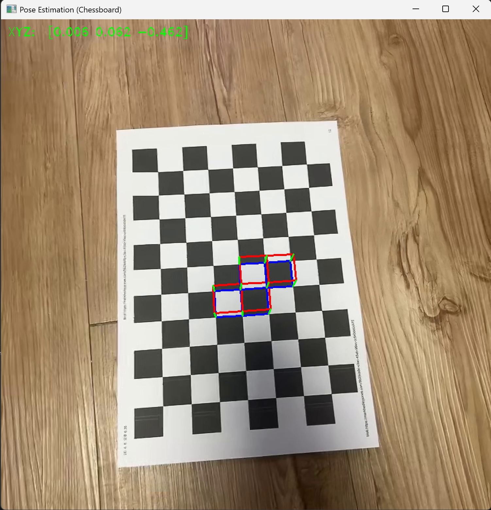

# AR_Tetris_OpenCV

An interactive AR Tetris application using OpenCV that overlays 3D Tetris blocks onto a real-world chessboard pattern via camera pose estimation and lens distortion correction.

## Example Results

### Live AR Tetris Rendering
This screenshot demonstrates a Tetris piece rendered in 3D perspective on a chessboard surface, with proper depth and perspective projection.



* **Input Video**: `my_video.mp4` (chessboard video feed)
* **Output Display**: Real-time AR rendering with interactive block control
* **Why it works**:
  Camera pose is estimated using the chessboard pattern as a reference plane. Tetris blocks are then projected from 3D world coordinates to 2D screen coordinates using the camera's intrinsic matrix and distortion coefficients.

## Camera Calibration Parameters

The intrinsic and distortion parameters were estimated from the video using chessboard corner detection.

* **RMS Error**: `0.5157795987383245`
* **Camera Matrix (K)**:

```
[[755.64546387,   0.        , 370.20995864],
 [  0.        , 754.14566119, 368.91385351],
 [  0.        ,   0.        ,   1.        ]]
```

* *fx ≈ 755.65, fy ≈ 754.15, cx ≈ 370.21, cy ≈ 368.91*

* **Distortion Coefficients**:

```
[0.29578981, -1.48042942, -0.00426474, -0.00186419, 2.57560477]
```

## Features

- **Chessboard-Based Pose Estimation**: Detects chessboard patterns and estimates camera pose in real-time using `solvePnP`.
- **3D Block Rendering**: Projects Tetris blocks from 3D world space to 2D screen coordinates with perspective projection.
- **Interactive Gameplay**: Control Tetris blocks with arrow keys and cycle through block types with Tab.
- **Lens Distortion Correction**: Applies camera calibration parameters to ensure accurate spatial alignment.
- **7 Tetris Block Types**: I, J, L, O, S, T, Z shapes with proper collision and boundary detection.
- **Real-Time Visualization**: Live camera feed with overlaid AR content and coordinate display.

## Future Development

This project provides the foundation for implementing a complete AR Tetris game. Based on the current codebase, the following features can be added to develop a fully playable AR Tetris game:

- Block falling speed and game difficulty adjustment
- Row completion detection and block removal mechanics
- Score calculation and game over logic
- Next block preview display
- Game state save and resume functionality

We plan to extend this project into a fully playable AR Tetris game with these additional features.

## Project Files

- `Tetris_BlockShowcase.py`: Main application script with pose estimation and interactive AR Tetris gameplay.
- `my_video.mp4`: Input video containing chessboard patterns for calibration and live gameplay.
- `screenshot.png`: Sample output showing AR Tetris blocks rendered on the chessboard.
- `README.md`: This file.

## Requirements

- Python 3.x
- OpenCV (`cv2`)
- NumPy

## How to Run

1. Place your chessboard video file as `my_video.mp4` in the project directory.

2. Run the AR Tetris application:

	```bash
	python Tetris_BlockShowcase.py
	```

3. **Controls**:
   - **Arrow Keys**: Move the active block left, right, up, and down
   - **Tab**: Cycle through Tetris block types (I, J, L, O, S, T, Z)
   - **Space**: Pause the video
   - **ESC**: Exit the application

## Technical Details

### Calibration Parameters
- **Board Pattern**: 10×7 chessboard corners detected per frame
- **Cell Size**: 0.025 meters (25mm)
- **Chessboard Detection**: Adaptive thresholding + normalization for robust corner detection

### Coordinate System
- **AR Board Bounds**: X: [-1, 6], Y: [-1, 9] (in board cell units)
- **Projection Method**: Perspective projection using camera intrinsics and pose estimation
- **Block Rendering**: 3D box geometry with blue upper face, blue lower face, and green edges

## Notes

- The application requires a clear video of a chessboard pattern for reliable pose estimation.
- Ensure the chessboard is well-lit and clearly visible for accurate corner detection.
- Block collision detection and game logic can be extended with additional features.
- Camera calibration quality directly affects the accuracy of AR block placement.
